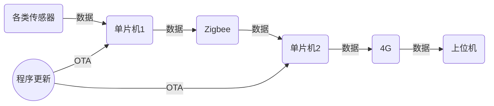

# 智慧花坛-下位机开发

## *一、所需器件*

- **主控芯片**：STM32F103RC
- **外设器件**：多功能传感器（RS485\MODBUS）、光照传感器（ADC\IIC\SPI）、空气质量传感器（ADC\IIC\SPI）、常闭式电磁阀门（DC24）、Zigbee模块、4G模块等

---

## *二、下位机运作大致流程图*

----

## *三、工作分配（暂定）*

- **多功能传感器**：李宇杰
- **光照传感器**：闻宇航、薛金龙、文君豪
- **空气质量传感器**：闻宇航、薛金龙、文君豪
- **4G模块**：李宇杰
- **Zigbee模块**：李宇杰
- **常闭式电磁阀门**：于志勇

----

## *四、工作方案（暂定）*

- **前期阶段**：目前外设器件未到，负责各个模块的同学先复习模块可能需要用到的STM32的知识，例如 ==IIC、ADC、SPI==等等，另外复习==Ucos-III==的使用。也可以在自己的开发板上练习相关类似器件（比如光照传感器）的使用。
- **中期阶段**：外设器件到达后，各模块负责的同学通过所学知识把数据==正确无误==地呈现在自己的STM32F103RC（待发）上，并反复测试以确保传感器与单片机通信成功。
- **后期阶段**：项目整合、维护和更新

----

## *五、注意事项*

- 代码清晰、简介、风格统一，变量名和函数名[^函数名]以及文件名规范，注重缩进、多用宏定义[^宏定义]、多用注释。具体要求参考==Data\Standards==文件夹下的==Embedded-C-code-specification.docx==文档。
- 阶段性地完成程序后即使上传本地库，并Push到Lower-computer仓库下的==develop==分支中。
- 每次更新程序版本时需打上注释（比如添加了什么内容等）。
- 注重团队合作，多沟通交流。

---

[^宏定义]: #define   LED1_ON   GPIOA->ODR &= ~(1 << 3);//开启LED1
[^函数名]:Void GPIO_Init(void){}

