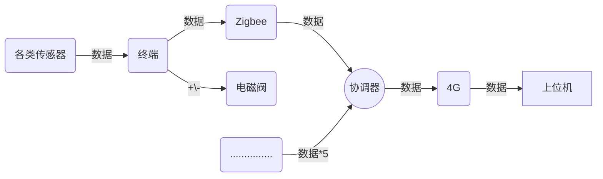

# 510实验室-智慧花坛项目下位机具体分工

## *一、所需器件*

- **主控单片机**：STM32F103RCT6
- **土壤传感器**：土壤综合传感器（RS485通信）
- **光照传感器**：BH1750FVI（IIC通信）
- **集成空气传感器**：福申FS009-7（IIC、USART通信）
- **电磁阀**：防水4分不发热DC12V（MOS管）
- **Zigbee**：A72（SPI通信）
- **4G模块**：BC28（串口发送AT指令）

---

## *二、下位机运作大致流程图*

---

## *三、具体工作分配*

###### `备注：主要以模块化分配工作`

- **光照\空气传感器**：闻宇航、薛金龙、文君豪

- **土壤传感器\4G模块**：李宇杰
- **Zigbee模块**：李宇杰（主）、闻宇航、薛金龙、文君豪

##### 文件整合1（终端）：李宇杰、闻宇航、薛金龙、文君豪

##### 文件整合2（协调器）：李宇杰

##### 项目整合：李宇杰

---

## *四、工作方案*

    - **1**：各模块负责人先在STM32F103RCT6平台上裸机实现模块功能，比如能正确读取传感器数据。并反复测试程序稳定性。
    - **2**：将程序移植至UCOS-III系统下运行，以确保其能在UCOS-III系统下稳定运行。
    - **3**：程序测试无误后将程序上传至develop-lower分支下的Software/Lower-computer文件夹下。

---

